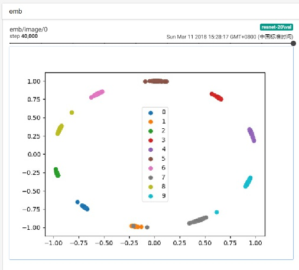

# Description
This project implements triplet loss and semi-hard mining in tensorflow. It show how to train model on mnist, cifar10 or cifar100 with triplet loss.

The semi-hard mining is *purely* implement with tensorflow, thus can seamless integrate into the tensorflow graph and take advantage of gpu acceleration. This speed up the training process.

# Requirement
- python==3.6
- tensorflow==1.6.0
- matplotlib

# Run
```bash
# train
python train.py

# tensorboard visualization
tensorboard --logdir log
```

# Tensorboard Visualization
Tensorboard visualization of the mnist data's features.


# Note
## 1. Number of Features
The number of features uses by default is 2, which makes visualization easy and converges well for mnist dataset. When training with cifar10, the number of features should be more for a better convergece. 

## 2. Semi-Hard Mining
Because the semi-hard mining is implemented in tensorflow, this project uses an end-to-end training process. The 'end-to-end' here means doing semi-hard mining and training at once. It can minimize the overhead involved by the hard mining process. 

This approach is possible only if the memory is not the issue.
However, training with triplet loss usually require large batch size for online hard mining, which takes a lot of memory for a large model. So it is not always possible using the 'end-to-end' approach.

One way to work around the memory issue is to separate hard mining and training process. It first do serveral times of semi-hard mining to find the hard triplet, and then feed the the model with the selected triplet. This approach involve much more overhead than the one above, but suitable for memory limited situation. 

With this aproach, the semi-hard mining code implemented here still can benefitted by the gpu acceleration with tensorflow. For how this work, see the code in [facenet](https://github.com/davidsandberg/facenet) and try to replace the semi-hard mining code with the one implemented here.


# Reference Project
- [facenet](https://github.com/davidsandberg/facenet), Face recognition using Tensorflow.